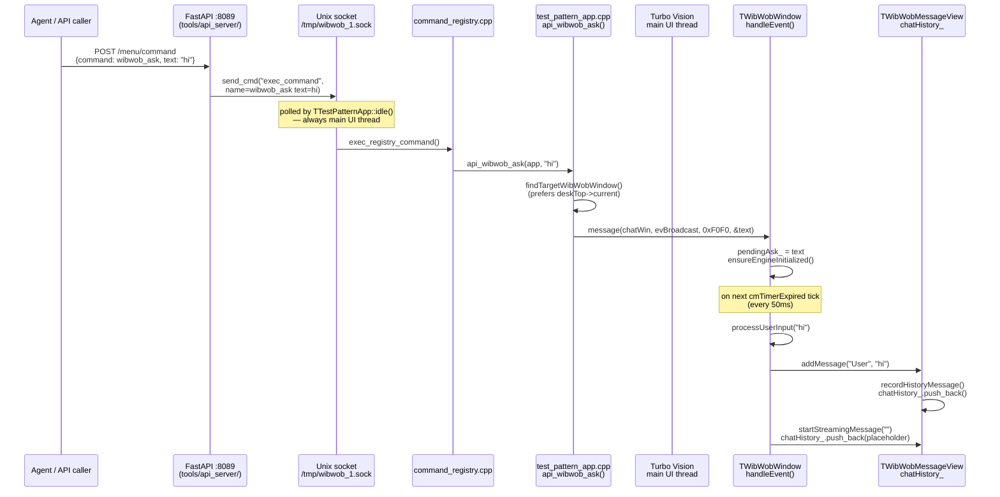
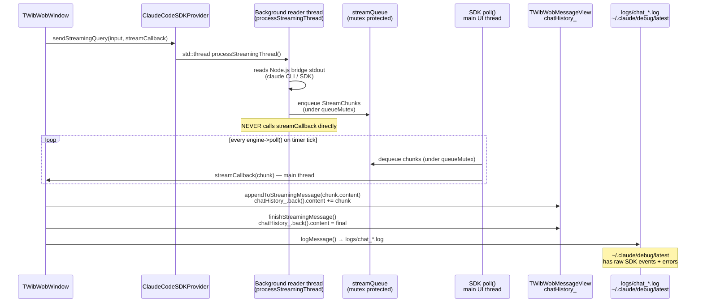
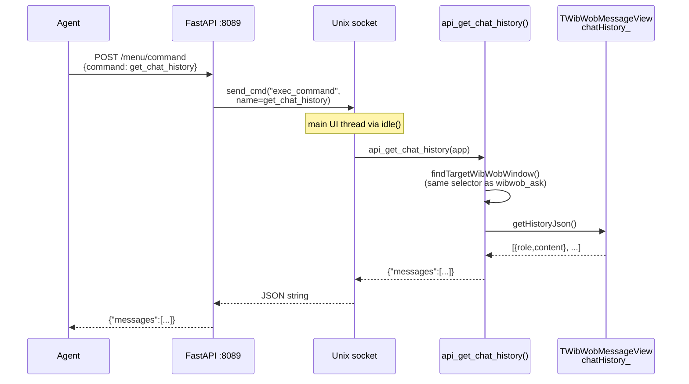

# WibWob-DOS Chat Message Flow

> How a message gets in, how a reply gets out, where logs live.

## Forward path (message in)

## Backward path (LLM reply out)

## Reading history back out

## Thread map

| Code location | Thread | chatHistory_ access |
|---|---|---|
| FastAPI handler | Uvicorn worker | none |
| `send_cmd()` in controller.py | Uvicorn worker | none |
| `ApiIpcServer::poll()` | **Main UI thread** | none |
| `api_wibwob_ask()` | **Main UI thread** | none |
| `TWibWobWindow::handleEvent()` | **Main UI thread** | none |
| `processUserInput()` | **Main UI thread** | indirect |
| `addMessage()` → `recordHistoryMessage()` | **Main UI thread** | **write** |
| `startStreamingMessage()` | **Main UI thread** | **write** (placeholder) |
| `processStreamingThread()` (SDK) | Background thread | **none** (queue only) |
| `ClaudeCodeSDKProvider::poll()` → streamCallback | **Main UI thread** | indirect |
| `appendToStreamingMessage()` | **Main UI thread** | **write** |
| `finishStreamingMessage()` | **Main UI thread** | **write** |
| `api_get_chat_history()` → `getHistoryJson()` | **Main UI thread** | **read** |

**No mutex on `chatHistory_`** — safe only because all access is on the main UI thread.

## Log files

| Log | What's in it | Path |
|---|---|---|
| Chat session log | Every message, stream chunk, timing | `logs/chat_YYYYMMDD_HHMMSS_ID.log` |
| Claude SDK debug | Raw SDK events, 403s, session writes | `~/.claude/debug/latest` |
| App stderr | IPC calls, wibwob_ask, history reads | `/tmp/wibwob_debug.log` |
| API server log | HTTP requests, IPC round-trips | `/tmp/wibwob_api.log` |
| tmux TUI pane | Visual screen state | `tmux capture-pane -t wibwob -p` |
